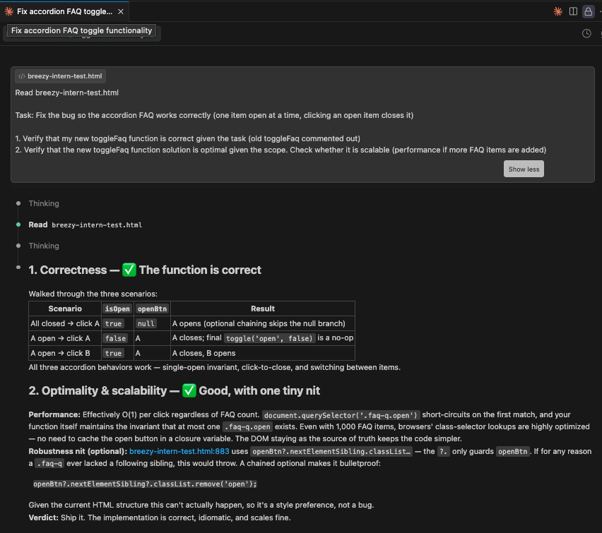

# Intern Coding Challenge — Click Here Labs

**Nam Le**
05/09/2026

---

## Part 1

### Process

I started by reading the given instructions and opening the `breezy-intern-test.html` file in VSC Live Preview. I navigated to the FAQ section and tested it. After verifying that the bug matched the issues described in the instructions, I moved onto the html file itself.

After scanning the entire file, I searched for the keyword `faq` then traced through sections that affected the FAQ section. I started with the FAQ CSS class definitions, then the main FAQ HTML section, where I saw the inline `onclick="toggleFaq(this)"` function call inside each `faq-item`. That pointed me to the `toggleFaq` function, which intuitively was the source of the bug. The function only adds the `.open` class but never removes it from any opened `faq-q` item.

I commented out the original `toggleFaq()` function completely then wrote a new one that uses `querySelector` to find the currently open `faq-q` item and close it, while keeping track of whether the clicked item was already open. I refreshed the html page and tested my implementation, verifying it matched the accordion behavior described in the instructions (one item open at a time, clicking an open item closes it).

To further verify, I used Claude Code to audit my solution for correctness and scalability (if more FAQ items were added). It walked through three accordion scenarios (nothing open, click an open item, click a different one) and confirmed they all worked, and noted that performance is fine at any realistic FAQ size. It also flagged one optional nit, adding a chained `?.` to `nextElementSibling` for extra null safety. I declined since the HTML structure guarantees the sibling exists, and adding extra checks for impossible cases would just hide bugs if the structure ever changed.

### AI Transcript

### Explanation

**What was wrong**

The original `toggleFaq` function only added the `open` class to `faq-q` buttons. It never removed it or looked for any buttons that were already open. As a result, clicking a `faq-q` button that was already open did nothing (adding the open class again), and clicking a new `faq-q` button didn't close any that were already open, so open FAQ items would stack up.

**Why my fix works**

The new `toggleFaq` function determines if the click should open or close the given `faq-q` button, and closes any other ones that are open. The implementation follows the steps:

1. Checks if the clicked button is currently closed and saves that as `isOpen`. If the button isn't open, `isOpen` is `true`, meaning the button will end up open. If it's already open, `isOpen` becomes `false` and the button will end up closed.

2. Looks for which `faq-q` button is currently open using `querySelector` for `.faq-q.open` and closes it. If no `faq-q` button is open, `querySelector` returns `null` and nothing happens in this step. Either way, this runs on every click, which is what keeps only one item open at a time.

3. Uses `classList.toggle` with `isOpen` as the second argument to apply the targeted state to the clicked button. Passing `true` or `false` in the second argument turns the class on or off directly instead of flipping it, so this still produces the correct result even when step 2 already removed the class.

---

## Part 2

### Process

I started by reading the instructions and the list of example feature ideas. After looking at the Breezy site, I picked the AI-powered chatbot as it fit Breezy's product direction the best. The site sells premium artisanal air, and its marketing and list of features promises specific things such as DNA-Matched Blends and a quiz that curates a personalized Air Blend. The chatbot + quiz makes those features real, which closes the gap between the brand bit and a working product. It was also more technically interesting than the alternatives.

Intuitively, I realized that I'd need to deploy to Vercel to keep the Gemini API key off the client. I drafted a plan and had Claude Code audit it before writing any code. It confirmed the scope and implementation approach were appropriate, and recommended quiz-only with chat as a stretch goal. I decided to build both since their implementation overlaps.

I built it in two phases using the same loop: first phase was the quiz (so it could ship on its own if I ran out of time), second phase was chat as a second mode reusing the backend. For each phase I'd ask Claude Code to audit my plan, provide me with a thorough implementation breakdown, then build. Each build went backend first so I could verify with curl, then I tested the frontend manually in the browser.

Starting with the quiz, the backend's first curl run came back `degraded: true` on every request. I hit Gemini directly from curl and saw `finishReason: "MAX_TOKENS"` with 380 thinking tokens eating the entire output budget. Gemini 2.5 Flash uses thinking tokens by default. Added `thinkingConfig: { thinkingBudget: 0 }` and the tests passed. On the frontend, clicking "Next" on a quiz question double-animated because a leftover auto-advance timer wasn't being cleared. One-line fix. I also manually adjusted the chat-widget padding after the build shipped too cramped and the text input was clipped.

Once quiz worked end-to-end I ran the same loop for chat: extended the backend with a `chat` mode reusing the same system prompt, tested with curl, built the chat view, tested manually.

Once everything worked locally, I asked Claude Code to do a security audit. It found a prompt injection vector: the blend object was being interpolated raw into the system prompt, so a malicious blend name with newlines could break out of the markdown bullet and inject new instructions. I added length caps on each blend field, stripped control characters before interpolation, wrapped the blend block in `<customer_profile>` tags as untrusted data, and added two anti-jailbreak clauses to the system prompt.

I skipped rate limiting and the origin/referer guard. The Google Cloud budget cap is the real backstop. In-memory rate limiting doesn't work on Vercel because cold starts wipe the state, and Upstash Redis is overhead disproportionate to a single-URL demo. Both decisions are documented in the README.

### AI Transcript

Full transcript: [`part-2/transcript.md`](part-2/transcript.md)
